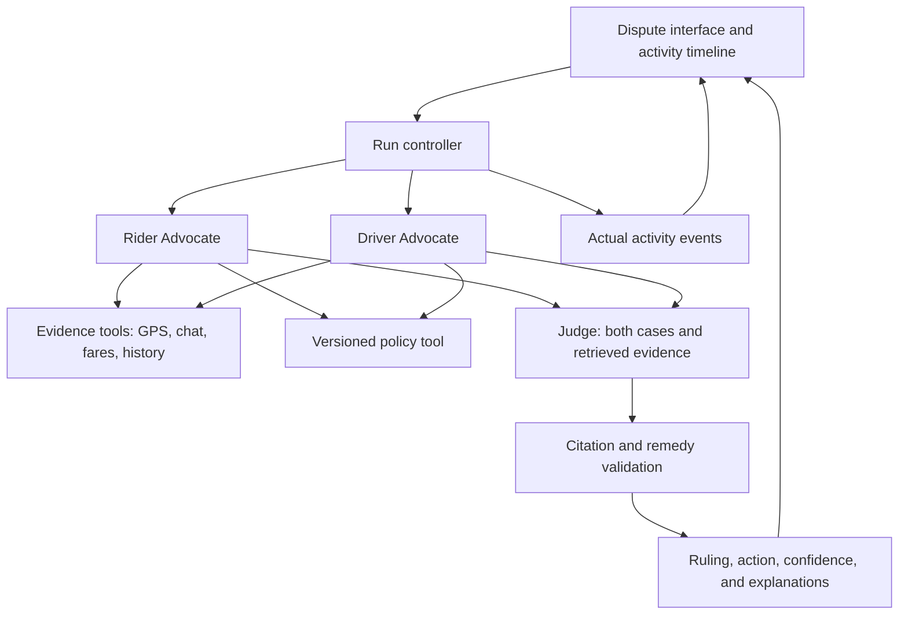

# Ryde Multi-Agent Dispute Resolution System

## Two-Lane Execution Plan

**Lane A:** Edward  
**Lane B:** Partner  
**Planning baseline:** Five working days, six focused hours per person daily  
**Total capacity:** 60 person-hours  
**Selected cases:** Route deviation and no-show charge  
**Implementation:** TypeScript throughout  

---

## 1. Objective

Build a working prototype that resolves route-deviation and no-show-charge disputes through three distinct AI agents:

1. A **Rider Advocate Agent** gathers evidence and builds the rider’s case.
2. A **Driver Advocate Agent** gathers evidence and builds the driver’s defense.
3. A **Judge Agent** reviews both cases, applies policy, and produces an explained ruling.

Judges must be able to observe evidence retrieval, case construction, the handoff to the Judge Agent, and the final decision.

The workspace begins as a fresh build. Both team members can contribute across the stack. The division below assigns clear ownership while preserving daily integration and cross-review.

---

## 2. Requirements Analysis

### 2.1 Mandatory eligibility and submission requirements

| ID | Requirement | Acceptance evidence |
|---|---|---|
| E1 | The project is original and built using CodeBuddy or WorkBuddy. | Real development sessions using one of those products. |
| E2 | Proof of product usage is included. | At least three readable development-chat screenshots, collected during real work. |
| E3 | The Ryde case study is selected and named at the beginning of the presentation. | Opening slide states “Ryde — Multi-Agent Autonomous Dispute Resolution System.” |
| E4 | Project title is provided. | Final title appears consistently in the repository, presentation, cover, and submission form. |
| E5 | Short blurb contains fewer than ten words. | Submitted blurb is no more than nine words. |
| E6 | Project description covers all required areas. | Overview, users, scenarios, pain points, value, architecture, prompting, and business impact are present. |
| E7 | A 16:9 cover image is provided. | 1920×1080 master plus a 384×216 export. |

### 2.2 Mandatory product requirements

| ID | Requirement | Acceptance evidence |
|---|---|---|
| M1 | Rider Advocate, Driver Advocate, and Judge are implemented as distinct roles. | Three separately observable executions with role-specific outputs. |
| M2 | Advocates autonomously gather evidence. | Actual evidence-tool calls are visible in the run trace. |
| M3 | Advocates build policy-grounded cases. | Arguments cite valid evidence IDs and policy-clause IDs. |
| M4 | Judge reviews both cases and applies policy. | Trace shows both cases reaching the Judge before adjudication. |
| M5 | Final output includes ruling, confidence, reasoning, recommended action, and explanations to both parties. | All fields are validated and displayed. |
| M6 | All four evidence families are supported. | GPS, chat, payment/fare, and historical profiles are retrieved and used. |
| M7 | At least two categories work end to end. | Route deviation and no-show charge both complete from filing to ruling. |
| M8 | Agent communication is observable. | Timeline shows retrieval, evidence, arguments, handoffs, evaluation, and result. |

### 2.3 Required deliverables

- Working end-to-end prototype.
- Architecture diagram showing the agents and key components.
- Live demo walkthrough.
- Complete source code in an accessible GitHub repository.
- Project title and a blurb under ten words.
- Comprehensive project description.
- At least three CodeBuddy or WorkBuddy development screenshots.
- 16:9 cover image.

### 2.4 Optional items

- Five-to-eight-minute demo video.
- Public live/demo URL, which earns bonus points.
- Evidence Collection Agent.
- Fraud and Bad-Faith Detection Agent.
- Policy and Precedent Agent or RAG system.
- Image analysis.
- Human escalation protocol.
- Learning feedback loop.
- SLA and routing manager.

Do not begin optional functionality before the full MVP and mandatory submission assets pass their acceptance gates.

### 2.5 Interpretation decisions

- CodeBuddy or WorkBuddy is required for the development process and proof of use. The supplied requirements do not mandate it as the deployed runtime model.
- Any LLM and agent framework are permitted. Use the team’s existing model API.
- Treat the Ryde challenge requirements as binding even though a later submission field uses softer “optional” wording.
- Use exact 16:9 exports. The suggested 380×216 size is only approximately 16:9; use 384×216 or 1920×1080.
- No authentic Ryde policy or sample dataset accompanies the documents. Use clearly labeled synthetic data and demonstration policies until organizer-provided material is available.
- Do not present the handbook’s industry figures as measured Ryde performance or verified project impact.

---

## 3. Definition of Success

By the end of Day 4:

- Both dispute categories complete through the live three-agent workflow.
- All four evidence families are supported.
- Evidence and policy citations are valid.
- Monetary recommendations are calculated and validated deterministically.
- Agent activity is visible in the interface.
- Required submission assets are review-ready.
- The project runs from documented setup instructions.

Day 5 is reserved for verification, rehearsal, defect repair, packaging, and submission.

---

## 4. Technical Architecture

### 4.1 Recommended stack

- **Frontend:** React with Vite and TypeScript.
- **Backend:** Node.js with Express and TypeScript.
- **Shared contracts:** Zod schemas shared between frontend and backend.
- **Tests:** Vitest.
- **Data:** Versioned JSON fixtures for disputes, policies, evidence, and expected outcomes.
- **Active run storage:** In-memory storage for the hackathon prototype.
- **Model integration:** One small adapter around the existing live model API.
- **Agent orchestration:** A custom, fixed three-agent workflow.

Use a committed dependency lockfile and a supported Node LTS version. Keep the required demonstration local. Authentication, databases, live Ryde integrations, real payment execution, and production infrastructure are outside the five-day baseline.

### 4.2 System flow



### 4.3 Agent responsibilities

| Component | Responsibility | Required output |
|---|---|---|
| Rider Advocate | Retrieve relevant evidence, apply policy, argue the rider’s position, and acknowledge counterevidence. | Rider case with cited arguments, requested remedy, counterevidence, and missing facts. |
| Driver Advocate | Independently retrieve evidence, apply policy, construct the driver’s defense, and acknowledge counterevidence. | Driver case with cited arguments, requested remedy, counterevidence, and missing facts. |
| Judge | Review both validated cases and the source evidence, then apply policy impartially. | Ruling, findings, remedy selection, confidence, reasoning, and separate explanations. |
| Run controller | Start, coordinate, time-box, and record the workflow. | Ordered events plus one validated final result or explicit failure. |
| Remedy validator | Validate the Judge’s selected remedy against fare data and policy. | Exact amount and action, or rejection of an invalid remedy. |

Run the two advocates in parallel. Start the Judge only after both advocate cases pass validation.

---

## 5. Genuine Autonomous Evidence Gathering

Each advocate receives two callable tools:

```ts
get_evidence({
  sources: ["gps", "chat", "payment", "history"]
})

get_policy({
  category: "route_deviation" | "no_show"
})
```

The backend binds these tools to the active dispute. Agents cannot request arbitrary customer or trip records.

Use an application-managed JSON tool protocol:

1. The model requests one or more tools in a validated JSON response.
2. The backend validates and executes the requests.
3. Tool results return to the same role.
4. The role produces its final structured case.

This design works even when the provider does not expose a native tool-calling format.

Execution limits:

- Maximum of two tool-request rounds per advocate.
- One directed repair attempt for malformed or unsupported model output.
- Twenty-second timeout per model request.
- Ninety-second deadline for the complete run.
- Visible failure if the run cannot complete safely.

The activity log must record actual tool requests and retrieval results. Do not simulate autonomy by injecting all evidence into a prompt and displaying fabricated tool events.

---

## 6. Evidence, Policy, and Deterministic Calculations

### 6.1 Evidence families

| Evidence family | Minimum implementation |
|---|---|
| GPS and telemetry | Timestamped actual and reference routes; calculated distance, duration, pickup proximity, waiting time, and unexpected stops. |
| Chat and communications | Sender, time, and text; identify agreements, disagreements, sentiment, contact attempts, and threats. |
| Payment and fare | Itemized charges, surge, promotion deduction, cancellation fee, currency, and paid amount; validate arithmetic deterministically. |
| Historical profiles | Dispute counts, ratings, and account age for both parties. These facts cannot establish fault on their own. |

### 6.2 Demonstration policy

Until official material arrives, label every rule as a **demonstration policy**.

| Category | Demonstration rule |
|---|---|
| Route deviation | Treat a detour as material when excess distance exceeds the greater of 500 metres or 10% of reference distance. Refund eligible excess-distance charges when evidence supports an unjustified detour. Supported rider consent or a documented legitimate diversion produces no refund. |
| No-show | Retain the charge when evidence shows the driver within 150 metres of pickup, waiting at least five minutes, with a recorded contact attempt before cancellation. Otherwise refund the paid no-show fee when sufficient evidence establishes noncompliance. |
| Both | Missing decisive evidence produces an incomplete case requiring review, rather than an unsupported successful ruling. Historical profiles cannot override current-trip evidence. |

These thresholds are team decisions for the prototype and must never be represented as authentic Ryde policy.

For route calculations, measure distance along the actual and supplied reference polylines. Describe the second path as a **reference route**, not an optimized road route unless a real routing service supplied it.

### 6.3 Money validation

- Store amounts as integer SGD cents.
- Build the permitted remedy catalogue on the server.
- Let the Judge select a remedy identifier rather than invent an amount.
- Calculate the final amount in deterministic code.
- Reject negative, fractional, non-finite, unsupported-currency, or excessive amounts.
- Prevent refunds exceeding the eligible paid charge.
- Require no-action outcomes to use a zero payment recommendation.

Minimum remedies:

- `keep_charge`: no refund.
- `refund_route_excess`: refund the deterministically calculated eligible excess charge.
- `refund_no_show_fee`: refund the exact paid no-show fee.

---

## 7. Shared Data and API Contracts

Freeze these contracts during the first shared session.

| Contract | Required fields |
|---|---|
| Dispute | ID, category, trip ID, rider claim, and driver statement. |
| Evidence | Stable ID, source family, timestamp, typed facts, and provenance. |
| Policy clause | Stable ID, version, category, rule text, and remedy criteria. |
| Advocate case | Side, summary, cited arguments, counterevidence, requested remedy, and missing facts. |
| Judge result | Ruling, cited findings, remedy ID, confidence from 0–1, reasoning, rider explanation, and driver explanation. |
| Final action | Remedy type, recipient when applicable, currency, integer amount, and readable recommendation. |
| Activity event | Run ID, sequence, timestamp, actor, event type, summary, and referenced evidence or policy IDs. |
| Run | Status, events, result if complete, and error or missing-evidence summary otherwise. |

Minimal endpoints:

| Endpoint | Behavior |
|---|---|
| `GET /api/fixtures` | List demonstration cases and categories. |
| `POST /api/runs` | Accept a fixture ID and optional edited rider claim; start a run and return its ID. |
| `GET /api/runs/:id?after=sequence` | Return status, new events, and the result or failure information. |

The interface polls once per second, deduplicates events by sequence, stops on completion or failure, and prevents duplicate submissions while a run is active.

---

## 8. Interface and Observability

Build a single main screen containing:

- Fixture selector and dispute submission area.
- Separate Rider Advocate and Driver Advocate panels.
- Chronological activity timeline.
- Evidence records and linked policy clauses.
- Structured arguments from each advocate.
- Judge findings and final ruling.
- Recommended action and exact amount.
- Confidence score.
- Natural-language reasoning.
- Separate explanations for rider and driver.
- Export control for the complete case and trace.

Show public case statements, tool activity, handoffs, timing, and concise decision reasons. Do not attempt to expose private model chain-of-thought.

Unknown citations, malformed responses, unsupported remedies, timeouts, and missing evidence must appear as clear failure or incomplete states. They must not silently turn into “no action.”

Treat instructions embedded inside chat logs or other evidence as untrusted case content.

---

## 9. Lane Ownership

| Workstream | Lane A — Edward | Lane B — Partner |
|---|---|---|
| Shared contracts | Own agent/run schemas and coordinate changes. | Review contracts and supply evidence/UI examples. |
| Agents and orchestration | Own model adapter, prompts, advocate execution, Judge, workflow, retries, and timeouts. | Test behavior against fixtures and report failures. |
| Evidence and calculations | Own final citation and remedy validation. | Own evidence adapters, synthetic fixtures, route/wait calculations, and fare checks. |
| Interface and observability | Produce backend events and validated results. | Own the interface, timeline, evidence viewer, result display, and trace export. |
| Evaluation | Fix model/orchestration problems and independently review outcomes. | Own the fixture matrix, evaluation runner, and scorecard. |
| Technical documentation | Own architecture diagram, setup guide, prompt explanation, metrics, and limitations. | Verify usability and assemble these materials into the submission. |
| Submission | Review claims, repository completeness, and technical accuracy. | Own title, blurb, project description, presentation, cover, screenshots, and final assembly. |
| Demonstration | Explain architecture, agents, and technical approach. | Operate the interface and explain the experience and results. |

---

## 10. Five-Day Execution Schedule

Each session is three hours per person. Daily integration and review are included.

### Day 1 — Contracts and foundations

#### First half

**Lane A**

- Joint scope and contracts: 0.75h.
- Backend and shared-schema scaffold: 0.75h.
- Model adapter and live connectivity check: 1.5h.

**Lane B**

- Joint scope and contracts: 0.75h.
- Demonstration policy and expected-outcome matrix: 1h.
- Initial route and no-show fixtures: 1.25h.

#### Second half

**Lane A**

- Run controller and event contract: 1.5h.
- Initial role prompts: 0.75h.
- First genuine CodeBuddy or WorkBuddy screenshot and caption: 0.25h.
- Joint smoke test: 0.5h.

**Lane B**

- Evidence adapters: 1.5h.
- Complete initial fixtures: 0.25h.
- Interface shell using labeled development events: 0.75h.
- Joint smoke test: 0.5h.

**Day 1 gate**

- Shared contracts agreed.
- Real model request succeeds.
- One fixture exists per category.
- Fixture evidence can be retrieved.
- Interface renders the event contract.
- First eligibility screenshot is archived.

### Day 2 — First live agent flow

#### First half

**Lane A**

- Two independent tool-using advocates: 1.5h.
- Judge prompt and response handling: 1.25h.
- Coordination: 0.25h.

**Lane B**

- Route and pickup/wait calculations: 1.5h.
- Chat, fare, and history processing: 1h.
- Initial interface connection: 0.25h.
- Coordination: 0.25h.

#### Second half

**Lane A**

- Parallel advocates followed by Judge: 1.5h.
- Retries and failure handling: 0.75h.
- Prompt adjustment and second Buddy screenshot: 0.25h.
- Joint integration: 0.5h.

**Lane B**

- Live timeline, evidence, advocate, and ruling panels: 1.5h.
- Initial evaluation checks: 1h.
- Joint integration: 0.5h.

**Day 2 gate**

- Route-deviation case completes through three real agent invocations.
- Actual evidence retrieval and policy access appear in the trace.
- Both advocate cases, citations, Judge findings, confidence, action, and explanations are visible.
- No-show completes at least one smoke run.

### Day 3 — Complete and freeze the MVP

#### First half

**Lane A**

- Refine no-show prompt behavior: 1h.
- Citation and remedy validation: 1.5h.
- Missing-evidence handling: 0.5h.

**Lane B**

- Evaluation runner and remaining golden fixtures: 1.5h.
- Expected-outcome checks: 1h.
- Evidence audit: 0.5h.

#### Second half

**Lane A**

- Complete failure paths: 0.5h.
- Adversarial and fairness checks: 1.5h.
- Architecture and setup draft: 0.75h.
- Gate review: 0.25h.

**Lane B**

- Robustness checks: 0.5h.
- Calculation audit: 0.25h.
- Loading and error interface: 0.75h.
- Submission outline and third Buddy screenshot: 1.25h.
- Gate review: 0.25h.

**Day 3 gate — feature freeze**

- Both categories work end to end.
- All four evidence families are supported.
- Invalid citations and remedies cannot produce successful rulings.
- Observable traces are complete.
- At least three development screenshots are safely archived.
- No optional feature work begins before this gate passes.

### Day 4 — Release candidate and required assets

#### First half

**Lane A**

- Repair highest-priority defects: 1.25h.
- Independently review evaluation outcomes: 0.75h.
- Complete architecture diagram and setup guide: 1h.

**Lane B**

- Improve interface clarity: 0.75h.
- Complete measured evaluation scorecard: 0.75h.
- Draft project description and presentation: 1.5h.

#### Second half

**Lane A**

- Prompt and metric explanation: 0.75h.
- Cross-review submission claims: 0.25h.
- Joint recorded walkthrough: 0.75h.
- Contingency: 0.5h.
- Package source and documentation: 0.5h.
- Gate review: 0.25h.

**Lane B**

- Cover image and development-proof archive: 1h.
- Joint recorded walkthrough: 0.75h.
- Contingency: 0.5h.
- Complete project description: 0.5h.
- Gate review: 0.25h.

**Day 4 gate**

- Release candidate is complete.
- All mandatory submission materials are review-ready.
- Live demonstration has been rehearsed.
- Backup recording and exported traces are available.

### Day 5 — Verify, rehearse, and submit

#### First half

**Lane A**

- Clean-clone setup and run: 1h.
- Technical and compliance review: 1h.
- Full rehearsal: 0.75h.
- Release coordination: 0.25h.

**Lane B**

- Full submission-checklist audit: 1h.
- Asset and repository-access checks: 1h.
- Full rehearsal: 0.75h.
- Release coordination: 0.25h.

#### Second half

**Lane A**

- Final source packaging: 0.5h.
- Archive release/submission evidence: 0.5h.
- Reserved defect time: 2h.

**Lane B**

- Final submission assembly: 0.5h.
- Submit and capture receipt/confirmation: 0.5h.
- Reserved defect time: 2h.

**Day 5 gate**

- Fresh checkout installs and runs successfully.
- Both demonstration cases succeed.
- Required assets exist and links resolve.
- No credentials or real personal data are exposed.
- Submission confirmation is saved.

The schedule reserves five person-hours across Days 4 and 5 for defects.

---

## 11. Collaboration and Integration Rules

- Lane A supplies one example payload for every shared agent, result, and event contract on Day 1.
- Lane B supplies one complete evidence fixture for each category on Day 1.
- Each lane develops against those examples so neither waits for the other’s full implementation.
- Use separate implementation branches for agents/backend and evidence/interface.
- Integrate at the scheduled daily checkpoint.
- Shared-contract changes require paired review and updated examples.
- The lane producing a capability supplies its acceptance evidence; the other lane verifies it.
- Maintain one shared checklist with requirement, owner, status, evidence, and blocker.

Critical path:

```text
Verified model and Buddy access
→ frozen contracts and demonstration policy
→ evidence adapters plus tool-using advocates
→ Judge and validation
→ two-category integration
→ observable interface
→ regression, documentation, rehearsal, and submission
```

---

## 12. Evaluation Plan

### 12.1 Golden cases

Prepare expected outcomes before running the model.

| ID | Scenario | Expected result |
|---|---|---|
| R1 | Material detour without supported justification or rider consent. | Partial refund of deterministically calculated excess charge. |
| R2 | Longer route expressly requested or approved by the rider. | No action; cite consent and applicable policy. |
| R3 | Longer route supported by a documented road closure or equivalent diversion. | No action; address rider claim and counterevidence. |
| N1 | Driver never reaches the pickup threshold; no-show fee charged. | Full refund of the paid no-show fee. |
| N2 | Driver arrives, waits sufficiently, and contacts the rider; rider is absent. | No action; cite arrival, waiting, and contact evidence. |
| N3 | Driver cancels before the required waiting period. | Full refund of the paid no-show fee. |

Use simple fares for the primary cases. Add at least one variation with surge and promotion fields so fare-breakdown validation is exercised.

### 12.2 Robustness tests

| Scenario | Required behavior |
|---|---|
| Missing decisive GPS or payment evidence | Mark incomplete and identify gaps; do not invent a ruling or amount. |
| Invented evidence or policy identifier | Reject; repair once or fail visibly. |
| Malformed model output | Attempt bounded repair and then fail clearly. |
| Provider timeout or outage | Enforce deadline, show failure, and allow another run. |
| Instructions embedded in evidence | Treat as quoted evidence, not executable instructions. |
| Changed ratings/account age with identical trip facts | Keep the outcome grounded in current-trip evidence. |
| Excessive or invalid monetary recommendation | Reject in deterministic validation. |
| Exact threshold values | Handle 150 metres, five minutes, detour threshold, rounding, and refund caps consistently. |
| Only one valid advocate case | Do not invoke the Judge or present a successful ruling. |

Use mocked model responses for deterministic validation and failure tests. Use the real model for golden-case acceptance and rehearsal.

### 12.3 Release acceptance criteria

The release passes only when:

- All six golden cases complete at least once through the real model with the expected ruling and amount.
- R1 and N2 each succeed in three consecutive rehearsal runs.
- Both advocates retrieve evidence through actual tool requests.
- All four evidence families are retrieved and meaningfully considered.
- Material findings cite existing evidence and applicable policy.
- Every final result includes ruling, confidence, reasoning, recommended action, and separate explanations.
- The trace shows retrieval, both cases, the Judge handoff, and the result.
- Failure tests cannot produce fabricated successful decisions.
- Installation, type checking, tests, build, and documented startup succeed from a clean checkout.

Target live cases completing within 60 seconds. This is a team acceptance target, not an organizer requirement. Always enforce the 90-second run deadline.

Record:

- Fixture pass count.
- Exact monetary correctness.
- Citation validity.
- Repeated-run consistency.
- Trace completeness.
- Observed end-to-end latency.
- Model-call/token or cost data when available.

Describe confidence as model-assessed confidence, not calibrated certainty. Present business savings as expected impact unless they have been measured.

---

## 13. Submission Package

| Artifact | Owner | Acceptance |
|---|---|---|
| Project identity | Lane B | Working title: **FairTrip**. Working blurb: **“Three agents resolve ride disputes with transparent evidence.”** |
| Project description | Lane B with Lane A inputs | Covers scenarios, users, value, pain points, workflow, architecture, prompting, metrics, expected impact, and limitations. |
| Presentation | Lane B | Opening states the exact Ryde case study. Includes workflow, architecture, demonstrations, evaluation, Buddy usage, and limitations. |
| Architecture diagram | Lane A | Accurately matches the implemented agents, evidence tools, policy, validation, and trace. |
| GitHub repository | Lane A packages; Lane B verifies | Complete source, fixtures, policies, prompts, lockfile, configuration example, setup/test/demo instructions, and no secrets. |
| Development evidence | Both capture; Lane B assembles | At least three genuine CodeBuddy or WorkBuddy screenshots covering foundation, implementation, and debugging. |
| Cover image | Lane B | 1920×1080 master plus 384×216 export, with readable title and safe margins. |
| Live walkthrough | Both | Demonstrates both categories from submission to autonomous ruling. |
| Backup | Both | Recorded walkthrough and exported traces, clearly labeled as recorded material. |
| Submission confirmation | Lane B | Final links, version, submitted assets, and receipt are saved. |

### Project description content

The final description should address:

- **Target users:** riders, drivers, and support operations.
- **Target scenarios:** route-deviation and no-show disputes.
- **Pain points:** slow review, high effort, inconsistency, and low transparency.
- **Value proposition:** fast, evidence-backed, policy-grounded, explainable resolution.
- **Business workflow:** submit → gather evidence → advocate → adjudicate → recommend action.
- **Technical architecture:** three agents, evidence tools, policy store, validators, and observable interface.
- **Prompting:** role-specific investigation, evidence-based arguments, counterevidence handling, and impartial adjudication.
- **Measured prototype value:** latency, fixture results, trace completeness, and consistency.
- **Expected impact:** faster standard-case handling and clearer explanations, described as projected rather than validated production performance.

---

## 14. Seven-Minute Demonstration Script

This structure can also be used for the optional five-to-eight-minute video.

| Time | Content | Presenter |
|---|---|---|
| 0:00–0:35 | Name the case study, users, and problem. | Lane A |
| 0:35–1:10 | Explain the architecture and distinct agent roles. | Lane A |
| 1:10–3:10 | Run R1 and show evidence gathering, advocacy, Judge ruling, and partial refund. | Lane B operates; Lane A narrates. |
| 3:10–4:40 | Run N2 and show a supported outcome favorable to the driver. | Lane B |
| 4:40–5:20 | Demonstrate incomplete-evidence or safe failure behavior. | Lane A |
| 5:20–6:10 | Present measured prototype results and limitations. | Lane B |
| 6:10–7:00 | Explain the build approach, Buddy usage, and a practical development lesson. | Both |

Preload the demo fixtures. Keep screenshots, exported traces, and the backup recording accessible. Clearly identify any recording or replay used during a service outage.

---

## 15. Scope Controls and Contingencies

### Trigger-based scope control

| Trigger | Response |
|---|---|
| Model connectivity fails on Day 1 | Resolve access immediately and suspend cosmetic work. |
| No complete live flow by the end of Day 2 | Cancel optional video work and interface embellishments; concentrate on integration. |
| Either category fails at the Day 3 gate | Spend reserve on category completion and validation; keep features frozen. |
| Buddy evidence is missing at Day 3 | Capture genuine development/debugging sessions immediately and verify readability. |
| Mandatory assets are incomplete at Day 4 | Both lanes finish them before any optional work. |
| Organizer dataset arrives late | Adapt it through existing contracts only if regression and rehearsal can still finish. Preserve labeled synthetic fixtures as fallback. |

### Three-day fallback

If only three days remain:

- Retain all mandatory requirements.
- Use in-memory fixtures and a plain single-screen interface.
- Keep the same three real agents and two categories.
- Use four balanced golden cases plus essential failure checks.
- Remove hosting, optional video, maps, animation, additional agents, RAG, and feedback loops.
- Capture Buddy proof on Day 1.
- Reserve at least one hour per person on Day 3 for defects.

### Seven-day extension

If seven days are available:

- Keep the Day 3 MVP gate and Day 5 release candidate.
- Use additional time first for broader evaluation and demo polish.
- Attempt a hosted demo link next.
- Consider only one functional stretch: a low-confidence human-review flag with an exportable case summary.
- Do not add image-authenticity detection within this schedule.

### Optional video timebox

The preferred bonus is demonstration polish. After the Day 4 gate passes, use at most two person-hours to finalize the recorded walkthrough into a compliant five-to-eight-minute video.

---

## 16. Final Definition of Done

The project is ready to submit only when all of the following are true:

- Rider Advocate, Driver Advocate, and Judge all work as distinct agents.
- Route deviation and no-show charge work end to end.
- Advocates autonomously retrieve evidence.
- GPS, chat, payment, and historical profiles are supported.
- Both advocates produce independent, cited cases.
- Judge receives both cases and the underlying evidence.
- Policy citations and evidence citations resolve to actual records.
- Final result contains ruling, confidence, reasoning, recommended action, and separate explanations.
- Monetary actions are deterministically validated.
- Agent interactions and handoffs are visible.
- Missing evidence and provider failures do not produce fabricated successful rulings.
- Live demo is rehearsed and a labeled backup is available.
- Architecture diagram accurately reflects the implementation.
- GitHub repository is complete and accessible.
- Fresh-checkout setup and tests succeed.
- Project title and nine-word-or-shorter blurb are finalized.
- Project description covers every required topic.
- At least three genuine CodeBuddy or WorkBuddy screenshots are archived.
- Exact 16:9 cover assets are complete.
- No credentials, real personal information, or unsupported business claims appear in the submission.
- Final submission links resolve and the confirmation is saved.

---

## 17. Source Documents

- `requirements.md` — Ryde challenge statement, mandatory agents, evidence sources, workflow, deliverables, and stretch goals.
- `submissions.md` — hackathon-wide eligibility, submission assets, CodeBuddy/WorkBuddy evidence, project description, cover, and optional bonuses.

